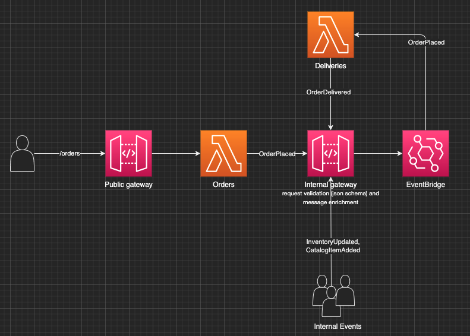

# brew-bar

Event driven app that mirrors order processing in a brew bar based on AWS resources managed via terraform

- Public gateway used for providing public access for placing Orders, can also plug in to an identity provider for authorizing clients/users.
- To enable clients to register events without changing backend code, you can [send client events](https://aws.amazon.com/blogs/compute/capturing-client-events-using-amazon-api-gateway-and-amazon-eventbridge/) to EventBridge via an API Gateway
- The internal AWS API Gateway performs validation on published events. It [supports](https://docs.aws.amazon.com/apigateway/latest/developerguide/models-mappings.html#models-mappings-models) Draft 4 of JSON Schema and plug the schema into an API endpoint in order to reject any requests that don’t conform to the schema.
- The event bus has a rule to dispatch order events to the delivery lambda. You can only create scheduled rules using the default event bus
- EventBridge has a hard limit on the event size at 265 KB



## Provision the stack

```sh
# Provision the stack
make stack APPLY=true

# Tear down
make destroy-stack
```

## Post an order

```sh
cd provisioning
curl "$(terraform output -raw base_url)/orders"
```
